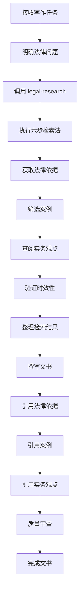

# 法律文书写作 (Legal Writing)

---

## 模块说明

本模块是 china-lawyer-analyst v2.0 的共享方法模块，提供法律文书写作的规范、格式和技巧。

**适用领域**：所有领域

**依赖模块**：core/philosophy.md, core/frameworks-core.md

**触发场景**：需要起草法律文书、起诉状、代理词、法律意见书时

---

## 内容

### 一、法律文书的类型

#### 1.1 客观型（Objective）
- **法律意见书**：中立分析法律问题
- **尽职调查报告**：客观披露风险
- **法律备忘录**：总结法律问题

#### 1.2 说服型（Persuasive）
- **起诉状**：提出诉讼请求
- **答辩状**：反驳对方观点
- **代理词**：说服法官支持我方观点
- **上诉状**：请求二审改判

---

### 二、法律文书的原则

#### 2.1 结构化
- 总分总结构
- 标题、段落分明
- 使用标号（一、（一）、1、（1））

#### 2.2 条理清晰
- 逻辑严密
- 层次分明
- 过渡自然

#### 2.3 法理并重
- 法律分析 + 事实分析
- 法理 + 情理
- 法律效果 + 社会效果

#### 2.4 引用规范
- 引用格式要规范
- 引用要准确
- 引用要全面

---

### 三、法律文书的引用格式

#### 3.1 法律条文
- 《中华人民共和国民法典》第五百七十七条
- 《中华人民共和国公司法》第二十条
- 《最高人民法院关于适用〈中华人民共和国民事诉讼法〉的解释》第九十条

#### 3.2 司法解释
- 《最高人民法院关于审理买卖合同纠纷案件适用法律问题的解释》（2012年3月31日由最高人民法院审判委员会第1545次会议通过，法释〔2012〕8号）
- 简称：《买卖合同解释》（法释〔2012〕8号）

#### 3.3 案例
- 最高人民法院（20XX）最高法民终XXX号民事判决书
- 浙江省高级人民法院（20XX）浙民终XXX号民事判决书
- 最高人民法院第XX号指导性案例

#### 3.4 行政法规、部门规章
- 《建设工程质量管理条例》（国务院令第279号）
- 《建设工程勘察设计管理条例》（国务院令第662号）

---

### 四、起诉状的撰写（民诉法第124条）

#### 4.1 原告信息
- 姓名、性别、民族、出生日期、身份证号、住址、联系电话

#### 4.2 被告信息
- 名称、住所地、法定代表人、联系电话

#### 4.3 诉讼请求
- 具体的诉讼请求（如请求判令被告支付违约金XX元）
- 诉讼请求要明确、具体、可执行

#### 4.4 事实和理由
- 事实：案件事实经过（时间、地点、人物、事件）
- 理由：法律依据、证据、法律分析

#### 4.5 证据和证据来源
- 列出证据清单
- 说明证据来源

#### 4.6 致送法院
- "此致XX市XX区人民法院"

#### 4.7 落款
- 具状人（签名或盖章）
- 日期

#### 4.8 附件
- 证据清单
- 身份证明文件
- 授权委托书（如有）

---

### 五、代理词的撰写

#### 5.1 标题
- "原告XXX诉被告XXX合同纠纷一案代理词"

#### 5.2 称呼
- "尊敬的审判长、审判员："

#### 5.3 前言
- 简要介绍案件情况

#### 5.4 代理意见（主体部分）
- 第一部分：案件事实
- 第二部分：法律依据
- 第三部分：法律分析
- 第四部分：总结陈词

#### 5.5 落款
- 代理人（签名或盖章）
- 日期

---

### 六、法律文书写作技巧

#### 6.1 使用主动语态
- ✅ 被告违反了民法典第577条
- ❌ 民法典第577条被被告违反

#### 6.2 使用短句
- ✅ 被告延迟交付2周，构成违约
- ❌ 被告在合同约定的交付期限届满之后延迟了2周才交付标的物，构成了违约行为

#### 6.3 避免冗余
- ✅ 合同有效
- ❌ 合同是有效的、合法的、具有法律约束力的

#### 6.4 使用法言法语
- ✅ 构成违约、承担赔偿责任
- ❌ 犯了错误、赔钱

---

### 七、法律文书写作清单

#### 7.1 内容审查
- [ ] 事实描述准确、完整
- [ ] 法律依据引用正确
- [ ] 逻辑推理严密
- [ ] 结论明确、具体

#### 7.2 格式审查
- [ ] 结构清晰、层次分明
- [ ] 标号使用正确
- [ ] 段落过渡自然
- [ ] 标题格式规范

#### 7.3 语言审查
- [ ] 法言法语使用准确
- [ ] 语句简洁明确
- [ ] 无错别字、语法错误
- [ ] 符合法律文书规范

#### 7.4 引用审查
- [ ] 法律条文引用格式正确
- [ ] 案例引用格式正确
- [ ] 司法解释引用格式正确
- [ ] 引用来源权威可靠

---

### 八、常见误区

**误区1：使用被动语态**
- 正确做法：使用主动语态，使表达更有力

**误区2：句子过长**
- 正确做法：使用短句，提高可读性

**误区3：冗余表达**
- 正确做法：简洁明了，避免重复

**误区4：口语化表达**
- 正确做法：使用法言法语，体现专业性

**误区5：逻辑混乱**
- 正确做法：先说结论，再说明理由，最后总结

---

### 八、法律检索与写作的集成（⭐⭐⭐⭐⭐）

#### 8.1 写作前的检索准备

**步骤 1：明确检索目标**
- 案件涉及的核心法律问题
- 需要引用的法律、司法解释、案例
- 文书类型所需的权威依据

**步骤 2：选择检索方法**
- ⭐ **推荐**：使用 `legal-research` 模块的六步检索法
- ❌ **不推荐**：使用 `web-search`（专业法律信息检索效果差）

**步骤 3：执行系统化检索**
```markdown
检索流程：
1. 明确法律问题 → 2. 确定检索关键词 → 3. 选择数据库
→ 4. 组合检索 → 5. 筛选结果 → 6. 验证时效性
```

---

#### 8.2 写作中的检索应用

**场景 1：引用法律条文**
- 使用 `legal-research` 推荐的专业数据库（威科先行、北大法宝）
- 验证法律的现行有效性（是否已被修改或废止）
- 确认条文号和内容的准确性
- 引用格式：`《中华人民共和国民法典》第五百七十七条`

**场景 2：引用司法解释**
- 优先检索最新司法解释
- 注意：`民法典合同编通则司法解释（2023）` 已废止旧解释
- 引用格式：`《最高人民法院关于适用〈中华人民共和国民法典〉合同编通则若干问题的解释》（法释〔2023〕13号）第X条`

**场景 3：引用案例**
- 按法院层级筛选（最高法 > 高级法院 > 中级法院）
- 按时间范围筛选（近3年案例优先）
- 按案由筛选（确保类案参考价值）
- 引用格式：`最高人民法院（2023）最高法民终XXX号民事判决书`

**场景 4：引用实务观点**
- 威科先行、北大法宝法学期刊
- 最高法院法官的权威解读
- 《理解与适用》系列书籍的观点

---

#### 8.3 检索结果的写作转化

**转化原则 1：法律依据 → 诉讼请求/法律意见**
- 检索：`民法典第577条（违约责任）`
- 转化：起诉状中的诉讼请求 "请求判令被告承担违约责任"

**转化原则 2：案例 → 类案参照/裁判规则**
- 检索：最高法指导案例XX号
- 转化：代理词中 "参照最高法第XX号指导案例的裁判要点..."

**转化原则 3：实务观点 → 法律分析**
- 检索：最高法院法官《理解与适用》中的观点
- 转化：法律意见书中的法律分析部分

---

#### 8.4 不同文书的检索重点

| 文书类型 | 检索重点 | 推荐数据库 | 检索顺序 |
|---------|---------|-----------|---------|
| **起诉状** | 请求权基础、法律依据 | 威科先行、北大法宝 | 1. 民法典条文<br>2. 最新司法解释<br>3. 地方司法文件 |
| **答辩状** | 抗辩理由、相反案例 | 法信、无讼案例 | 1. 对抗性条文<br>2. 相反案例<br>3. 实务抗辩观点 |
| **代理词** | 综合法律依据、案例、观点 | 综合数据库 | 1. 法律条文<br>2. 司法解释<br>3. 指导案例<br>4. 实务观点 |
| **法律意见书** | 权威解读、学术观点 | 北大法宝期刊、知网 | 1. 法律条文<br>2. 权威解读<br>3. 学术观点 |
| **合同** | 条文解释、合同范本 | 威科先行 | 1. 法律条文<br>2. 司法解释<br>3. 合同范本 |

---

#### 8.5 检索质量控制清单

**准确性验证**：
- [ ] 法律条文号、内容准确无误
- [ ] 司法解释现行有效
- [ ] 案例未被撤销或改判

**完整性验证**：
- [ ] 法律依据全面（未遗漏重要条文）
- [ ] 案例检索充分（包含支持性和相反案例）
- [ ] 实务观点多元（包含不同学术观点）

**时效性验证**：
- [ ] 法律为最新版本（已修正）
- [ ] 司法解释为最新发布
- [ ] 案例为近期裁判（近3年优先）

---

#### 8.6 检索与写作的工作流



---

#### 8.7 注意事项

**⚠️ 重要提示**：
1. **避免使用 web-search 检索法律信息**：专业法律信息检索应使用 `legal-research` 模块
2. **法律检索先行**：写作前先完成检索，确保引用依据准确、完整、权威
3. **验证时效性**：法律、司法解释、案例可能随时更新，务必验证现行有效性
4. **记录检索来源**：在文书中注明引用来源（如"威科先行""北大法宝"）
5. **区分观点层级**：指导案例 > 公报案例 > 典型案例 > 一般案例

**💡 效率提升**：
- 建立常用法律依据库（民法典条文、常用司法解释）
- 建立类案检索模板（按案由、法院层级、时间范围）
- 使用专业数据库的高级检索功能（威科先行、北大法宝）
- 定期更新法律依据库（关注最新立法、司法解释）

---

#### 8.8 相关模块

- **法律检索方法**：详见 [legal-research](../methods/legal-research.md)
- **请求权基础分析**：详见 [frameworks/request-power-basis.md]
- **案例检索指引**：详见 [legal-research.md](../methods/legal-research.md) 第2.2节

---

### 九、快速参考

| 文书类型 | 核心要素 | 注意事项 |
|---------|---------|---------|
| 起诉状 | 诉讼请求、事实理由 | 具体、明确、可执行 |
| 答辩状 | 抗辩理由、事实依据 | 针对性反驳 |
| 代理词 | 代理意见、法律依据 | 说服性强 |
| 法律意见书 | 法律分析、风险评估 | 客观中立 |
| 合同 | 权利义务、违约责任 | 明确具体 |

---

**版本信息**：v2.1
**最后更新**：2026年1月16日
**维护者**：china-lawyer-analyst 项目组
**本次更新**：新增"八、法律检索与写作的集成"章节，集成 legal-research 模块能力
