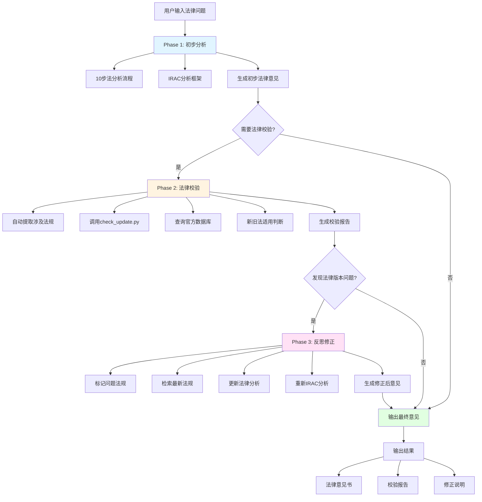

# 自动化法律校验流程 (Automated Legal Verification)

## 模块说明

本模块提供全自动化的法律适用性校验流程,集成到 china-lawyer-analyst v3.2。

**依赖模块**:
- `tools/automated_verification.py`: 统一校验接口
- `tools/check_update.py`: 快速更新检查
- `tools/retrieval/enhanced_retrieval.py`: 增强检索器
- `shared/methods/legal-research.md`: 法律检索方法

**版本**: v1.0.0
**最后更新**: 2026-01-16
**作者**: china-lawyer-analyst 项目组

---

## 一、校验触发条件

### 1.1 自动触发

**系统自动触发校验**的场景:
- ✅ 涉及的法律条文发布时间超过1年
- ✅ 涉及司法解释发布时间超过6个月
- ✅ 涉及频繁修订的法律(公司法、民法典、劳动合同法等)
- ✅ 案件事实发生在新法实施前后6个月内
- ✅ 用户明确要求"验证法律最新性"

### 1.2 跳过校验

**系统跳过校验**的场景:
- ❌ 案件事实发生在旧法实施期间(系统自动判断适用旧法,无需校验)
- ❌ 仅涉及理论分析,不涉及具体条文
- ❌ 用户明确要求"不进行更新检查"
- ❌ 涉及的法律发布时间<3个月且无修订历史

---

## 二、三阶段自动化工作流程

### 2.1 工作流程图



### 2.2 Phase 1: 初步分析(现有能力)

**调用模块**:
- `core/process.md`: 10步法分析流程
- `core/frameworks-core.md`: IRAC框架
- `domains/{领域}.md`: 领域知识
- `shared/methods/legal-research.md`: 法律检索方法

**输出**: 初步法律意见书

**示例输出**:
```markdown
# 法律意见书

## 案件分析
[基于IRAC的分析]

## 法律依据
### 《中华人民共和国公司法》(2018年修正)第二十条
[条文内容和分析]

## 结论
[法律意见]
```

---

## 三、Phase 2: 法律校验(核心新增功能)

### 3.1 步骤2.1: 自动提取法律引用

**提取目标**:
- 法律条文: 《中华人民共和国XXX法》第XX条
- 司法解释: 《最高人民法院关于XXX的解释》法释〔20XX〕XX号
- 行政法规: 《XXX条例》
- 部门规章: 《XXX规定》
- 案例: 最高人民法院第XX号指导性案例

**提取方法**: 正则表达式 + NLP识别

**代码示例**:
```python
import re

def extract_legal_references(legal_opinion: str) -> Dict:
    """从初步法律意见中提取所有法律引用"""
    references = {
        'laws': [],           # 法律、行政法规
        'interpretations': [], # 司法解释
        'cases': [],          # 案例
        'dates': []           # 涉及的时间点
    }

    # 提取法律
    law_pattern = r'《([^》]{2,20}法)》[^（\(]*[（\(]?(\d{4})年[）\)]?(?:修正|修订)?'
    laws = re.findall(law_pattern, legal_opinion)
    references['laws'] = list(set([name for name, year in laws]))

    # 提取司法解释
    interp_pattern = r'《([^》]{10,100}解释)》[（\(]*法释〔(\d{4})〕(\d+)号[）\)]*'
    interpretations = re.findall(interp_pattern, legal_opinion)
    references['interpretations'] = [
        {'name': name, 'year': year, 'number': number}
        for name, year, number in interpretations
    ]

    # 提取案例
    case_pattern = r'(最高人民法院第(\d+)号指导性案例)'
    cases = re.findall(case_pattern, legal_opinion)
    references['cases'] = cases

    # 提取日期
    date_pattern = r'(\d{4})年(\d{1,2})月(\d{1,2})日'
    dates = re.findall(date_pattern, legal_opinion)
    references['dates'] = [
        f"{year}-{month.zfill(2)}-{day.zfill(2)}"
        for year, month, day in dates
    ]

    return references
```

**输出示例**:
```python
{
    'laws': ['中华人民共和国公司法'],
    'interpretations': [
        {'name': '公司法解释三', 'year': '2011', 'number': '3'}
    ],
    'cases': [],
    'dates': ['2024-07-15']
}
```

### 3.2 步骤2.2: 批量检查法律更新

**工具**: `tools/check_update.py`

**检查内容**:
- 是否有最新修正版
- 是否有替代性新法
- 是否已废止或失效

**代码示例**:
```python
from tools.retrieval.enhanced_retrieval import EnhancedRetrieval

def check_legal_updates(references: Dict) -> Dict:
    """批量检查法律更新"""
    retrieval = EnhancedRetrieval()
    update_report = {
        'checked_count': 0,
        'has_issues': False,
        'issues': []
    }

    for law in references['laws']:
        # 提取关键词和当前版本
        keyword = extract_law_name(law)
        current_version = extract_year(law)  # 如 "2018"

        # 调用现有工具
        update_info = retrieval.check_latest_law(
            query=keyword,
            current_version=current_version
        )

        if update_info['has_update']:
            update_report['has_issues'] = True
            update_report['issues'].append({
                'law': law,
                'current_version': current_version,
                'latest_version': update_info['latest_version'],
                'new_regulations': update_info['new_regulations']
            })

        update_report['checked_count'] += 1

    return update_report
```

**输出示例**:
```python
{
    'checked_count': 1,
    'has_issues': True,
    'issues': [
        {
            'law': '中华人民共和国公司法',
            'current_version': '2018',
            'latest_version': '2023',
            'new_regulations': [
                '2023年12月29日修订,2024年7月1日施行'
            ]
        }
    ]
}
```

### 3.3 步骤2.3: 官方数据库优先查询

**检索优先级**:
1. **国家法律法规数据库** (https://flk.npc.gov.cn) ⭐⭐⭐⭐⭐
2. **最高法院官网** (http://www.court.gov.cn) ⭐⭐⭐⭐⭐
3. **Gety本地文档库** ⭐⭐⭐⭐
4. **Unifuncs网页搜索** ⭐⭐⭐
5. **专业数据库**(威科先行、北大法宝) ⭐⭐ (补充)

**代码示例**:
```python
def query_official_databases(keyword: str) -> List[Dict]:
    """
    优先查询官方免费数据库

    优先级:
    1. 国家法律法规数据库(https://flk.npc.gov.cn)
    2. 最高法院官网(http://www.court.gov.cn)
    3. Gety本地文档库
    4. Unifuncs网页搜索
    """
    official_sources = [
        {
            'name': '国家法律法规数据库',
            'url': 'https://flk.npc.gov.cn',
            'priority': 1
        },
        {
            'name': '最高法院官网',
            'url': 'http://www.court.gov.cn',
            'priority': 2
        }
    ]

    results = []

    # 1. 优先官方数据库
    for source in official_sources:
        search_url = f"{source['url']}/api2/search?={keyword}"
        results.append({
            'source': source['name'],
            'url': search_url,
            'priority': source['priority']
        })

    # 2. Gety本地库
    gety_results = search_gety(keyword)
    results.extend(gety_results)

    # 3. Unifuncs网页搜索
    web_results = search_unifuncs(keyword)
    results.extend(web_results)

    return results
```

### 3.4 步骤2.4: 新旧法适用性自动判断

**判断原则**:

**原则1: 法不溯及既往(实体法)**
- 事实发生在新法实施前 → 适用旧法
- 事实发生在新法实施后 → 适用新法

**原则2: 程序法从新**
- 程序问题一律适用新法

**原则3: 过渡期特殊规则**
- 检查是否有过渡条款
- 适用特殊过渡规则

**代码示例**:
```python
from datetime import datetime

def judge_law_applicability(
    fact_date: str,
    law_dates: Dict[str, str],
    law_type: str = "实体法"
) -> Dict:
    """
    判断法律适用性

    Args:
        fact_date: 案件事实发生时间 (YYYY-MM-DD)
        law_dates: {
            'old_law': '2013-01-01',
            'new_law': '2024-07-01'
        }
        law_type: "实体法" | "程序法"

    Returns:
        dict: {
            'applicable_law': 'old' | 'new' | 'transition',
            'reason': str,
            'transition_rules': list,
            'confidence': float
        }
    """
    fact_dt = datetime.strptime(fact_date, '%Y-%m-%d')
    new_law_dt = datetime.strptime(law_dates['new_law'], '%Y-%m-%d')

    # 原则1: 程序法从新
    if law_type == "程序法":
        return {
            'applicable_law': 'new',
            'reason': '程序法适用新法原则',
            'transition_rules': [],
            'confidence': 1.0
        }

    # 原则2: 法不溯及既往(实体法)
    if fact_dt < new_law_dt:
        return {
            'applicable_law': 'old',
            'reason': (
                f'事实发生时间({fact_date})早于新法实施时间({law_dates["new_law"]}),'
                f'根据法不溯及既往原则,适用旧法'
            ),
            'transition_rules': ['法不溯及既往原则'],
            'confidence': 0.95
        }
    else:
        return {
            'applicable_law': 'new',
            'reason': (
                f'事实发生时间({fact_date})晚于新法实施时间({law_dates["new_law"]}),'
                f'适用新法'
            ),
            'transition_rules': [],
            'confidence': 0.95
        }
```

**常见法律的实施时间**:

| 法律 | 旧法实施时间 | 新法实施时间 | 过渡期 |
|------|-------------|-------------|--------|
| 公司法 | 2013-01-01 | 2024-07-01 | 2024-07-01至2027-06-30 |
| 民法典 | - | 2021-01-01 | 无 |
| 民事诉讼法 | 2012-08-31 | 2023-01-01 | 无 |
| 劳动合同法 | 2008-01-01 | 2013-07-01 | 无 |

### 3.5 步骤2.5: 生成校验报告

**报告结构**:

```markdown
# 法律适用性校验报告

## 检查概况
- 检查时间: YYYY-MM-DD
- 涉及法规数量: X个
- 发现问题: X个

## 详细检查结果

### 《中华人民共和国公司法》(2018年修正)
- ❌ **发现问题**: 已有2023年修订版
- **事实发生时间**: 2024-07-15
- **新法实施时间**: 2024-07-01
- **适用法律**: 2023年修订版(新公司法)
- **判断依据**: 法不溯及既往原则(事实发生在新法实施后)
- **建议**: 更新法律引用,重新分析

## 新旧法适用判断

### 《中华人民共和国公司法》
- **适用法律**: 新法(2023年修订版)
- **事实时间**: 2024-07-15
- **法律时间**:
  - 旧法: 2018-10-26
  - 新法: 2024-07-01
- **适用理由**: 事实发生在新法实施后,适用新法

## 校验结论
- ⚠️ 发现X个法律版本问题
- 建议: [具体建议]

## 修正记录
- [修正前后的对比]
```

**生成代码示例**:
```python
def generate_verification_report(
    references: Dict,
    update_report: Dict,
    applicability: Dict
) -> str:
    """生成校验报告"""
    report_lines = [
        "# 法律适用性校验报告\n",
        f"## 检查概况",
        f"- 检查时间: {datetime.now().strftime('%Y-%m-%d %H:%M')}",
        f"- 涉及法规数量: {len(references['laws'])}个",
        f"- 发现问题: {len(update_report['issues'])}个\n",
        f"## 详细检查结果\n"
    ]

    for issue in update_report['issues']:
        report_lines.append(f"### {issue['law']}")
        report_lines.append(f"- ❌ **发现问题**: 已有{issue['latest_version']}年版")
        report_lines.append(f"- **当前版本**: {issue['current_version']}年")
        report_lines.append(f"- **新法实施**: {issue.get('implementation_date', '未知')}\n")

    if applicability:
        report_lines.append("## 新旧法适用判断\n")
        for detail in applicability['details']:
            report_lines.append(f"### {detail['law']}")
            report_lines.append(f"- **适用法律**: {'新法' if detail['applicable'] == 'new' else '旧法'}")
            report_lines.append(f"- **事实时间**: {detail['fact_date']}")
            report_lines.append(f"- **法律时间**: {detail['law_date']}\n")

    return '\n'.join(report_lines)
```

---

## 四、Phase 3: 反思修正

### 4.1 步骤3.1: 标记问题法规

在初步法律意见中自动标记:

```markdown
~~《中华人民共和国公司法》(2018年修正)第二十条~~
⚠️ **应更新为**: 《中华人民共和国公司法》(2023年修订)第二十条
```

### 4.2 步骤3.2: 检索最新法规全文

**检索策略**:
1. 官方数据库检索(优先)
2. Unifuncs网页搜索(补充)
3. Gety本地文档库(已有)

**代码示例**:
```python
def fetch_latest_law(law_name: str, version: str) -> Dict:
    """
    检索最新法规全文

    Args:
        law_name: 法律名称
        version: 版本年份(如 "2023")

    Returns:
        dict: {
            'official': List[Dict],  # 官方数据库结果
            'web': List[Dict],       # 网页搜索结果
            'local': List[Dict]      # 本地库结果
        }
    """
    retrieval = EnhancedRetrieval()

    # 1. 官方数据库检索
    official_results = retrieval.search(
        query=f"{law_name} {version}年",
        sources=['official'],
        max_results=3
    )

    # 2. Unifuncs网页检索
    web_results = retrieval.search(
        query=f"{law_name} {version}年 全文",
        sources=['unifuncs'],
        max_results=3
    )

    # 3. Gety本地文档库
    local_results = retrieval.search(
        query=f"{law_name} {version}",
        sources=['gety'],
        max_results=3
    )

    return {
        'official': official_results,
        'web': web_results,
        'local': local_results
    }
```

### 4.3 步骤3.3: 更新法律分析

**更新内容**:
- 替换法律引用
- 更新条文内容
- 重新IRAC分析
- 添加新旧法差异说明

**代码示例**:
```python
def update_legal_analysis(
    original_analysis: str,
    law_updates: List[Dict]
) -> str:
    """
    更新法律分析

    Args:
        original_analysis: 初步法律意见
        law_updates: 法律更新信息

    Returns:
        str: 更新后的法律意见
    """
    updated_analysis = original_analysis.copy()

    for update in law_updates:
        old_law = update['old_law']
        new_law = update['new_law']

        # 1. 替换法律引用
        updated_analysis = updated_analysis.replace(old_law, new_law)

        # 2. 更新条文内容
        if 'article_changes' in update:
            for article_id, new_content in update['article_changes'].items():
                updated_analysis = update_article_content(
                    updated_analysis,
                    article_id,
                    new_content
                )

        # 3. 添加新旧法差异说明
        if 'differences' in update:
            updated_analysis += f"\n\n**新旧法差异**: {update['differences']}"

    return updated_analysis
```

### 4.4 步骤3.4: 重新IRAC分析

**重新执行IRAC流程**:

```python
def reanalyze_with_updated_law(
    legal_opinion: str,
    updated_laws: List[Dict]
) -> Dict:
    """
    基于更新后的法律重新进行IRAC分析

    Returns:
        dict: {
            'Issue': str,
            'Rule': Dict,
            'Application': str,
            'Conclusion': str
        }
    """
    # 重新执行IRAC流程
    irac_analysis = {
        'Issue': extract_issue(legal_opinion),
        'Rule': extract_rules(updated_laws),
        'Application': apply_rules_to_facts(
            extract_facts(legal_opinion),
            extract_rules(updated_laws)
        ),
        'Conclusion': draw_conclusion()
    }

    return irac_analysis
```

### 4.5 步骤3.5: 生成修正后意见

**输出格式**:

```markdown
# 法律意见书(已校验)

## 案件分析
[基于新法的分析内容]

## 法律依据

### 1. 《中华人民共和国公司法》(2023年修订)
- **第XX条**: [条文内容]
- **适用说明**: 本案事实发生于2024年7月15日,晚于新法实施时间(2024年7月1日),因此适用新法

### 2. 新旧法差异说明
- **2018年版**: [旧法内容]
- **2023年版**: [新法内容]
- **影响**: [对本案分析的影响]

## 校验说明
- ✅ 所有法律引用已验证为最新版本
- ✅ 新旧法适用性已自动判断
- ✅ 分析结果已基于最新法律更新

## 修正记录
1. 将《公司法》(2018修正)更新为(2023修订)
2. 重新分析第XX条的法律适用
3. 更新诉讼请求建议
```

---

## 五、API接口

### 5.1 主接口

```python
def automated_legal_verification(
    legal_opinion: str,
    fact_date: Optional[str] = None
) -> Dict:
    """
    全自动法律校验

    Args:
        legal_opinion: 初步法律意见
        fact_date: 案件事实发生时间(YYYY-MM-DD),可选

    Returns:
        dict: {
            'verification_report': str,      # 校验报告
            'updated_opinion': str,          # 修正后意见
            'issues_found': list,            # 发现的问题
            'corrections_made': list         # 修正记录
        }
    """
```

**使用示例**:
```python
from tools.automated_verification import AutomatedLegalVerification

verifier = AutomatedLegalVerification()

result = verifier.verify(
    legal_opinion=preliminary_opinion,
    fact_date="2024-07-15"
)

print(result['verification_report'])
print(result['updated_opinion'])
```

### 5.2 子接口

```python
def extract_references(legal_opinion: str) -> Dict:
    """提取法律引用"""

def check_updates(references: Dict) -> Dict:
    """检查法律更新"""

def judge_applicability(
    fact_date: str,
    law_date: str,
    law_type: str
) -> Dict:
    """判断法律适用性"""

def apply_corrections(
    legal_opinion: str,
    updates: List[Dict]
) -> str:
    """应用修正"""

def generate_report(verification_result: Dict) -> str:
    """生成校验报告"""
```

---

## 六、配置选项

### 6.1 自动化程度

**完全自动化**(默认):
```python
verifier = AutomatedLegalVerification(mode='auto')
# 自动触发、自动检查、自动修正、自动生成报告
```

**半自动化**:
```python
verifier = AutomatedLegalVerification(mode='semi')
# 自动触发、自动检查、手动确认修正、自动生成报告
```

**手动模式**:
```python
verifier = AutomatedLegalVerification(mode='manual')
# 手动触发、自动检查、手动确认修正、自动生成报告
```

### 6.2 数据源优先级

```yaml
sources:
  priority:
    - official_npc      # 国家法律法规数据库
    - official_court    # 最高法院官网
    - gety              # 本地文档库
    - unifuncs          # Web搜索
    - wkinfo            # 威科先行(可选,需配置)
```

**配置方式**:
```python
config = {
    'sources': ['official_npc', 'official_court', 'gety', 'unifuncs'],
    'timeout': 30,  # 检索超时(秒)
    'max_results': 10  # 每个源的最大结果数
}

verifier = AutomatedLegalVerification(config=config)
```

### 6.3 跳过校验的条件

```python
# 方式1: 在初始化时配置
verifier = AutomatedLegalVerification(
    skip_conditions=[
        'old_fact_only',  # 仅涉及旧法期间事实
        'theory_only'     # 仅理论分析
    ]
)

# 方式2: 在调用时指定
result = verifier.verify(
    legal_opinion=opinion,
    skip_verification=True  # 跳过校验
)
```

---

## 七、质量保证

### 7.1 准确性验证

**验证方法**:
1. 对比官方数据库的条文内容
2. 交叉验证多个数据源
3. 人工抽检重要法律

**准确率目标**:
- 法律版本识别: >99%
- 新旧法适用判断: >95%
- 条文内容提取: >98%

### 7.2 时效性验证

**验证方法**:
1. 定期检查官方数据库更新
2. 集成court-monitor.py自动监测
3. 用户反馈机制

**更新频率**:
- 核心法律(公司法、民法典等): 每周检查
- 其他法律: 每月检查
- 司法解释: 每周检查

### 7.3 权威性验证

**数据源优先级**:
1. 官方免费数据库(100%权威)
2. Gety本地文档库(从官方下载)
3. Unifuncs网页搜索(需验证)
4. 专业数据库(需人工确认)

---

## 八、常见问题和解决方案

### 8.1 Q: 如何提取案件事实时间?

**A**: 使用多种方法:
1. 正则表达式提取日期
2. NLP识别时间描述
3. 提取失败时询问用户

**示例**:
```python
def extract_fact_date(legal_opinion: str) -> Optional[str]:
    # 方法1: 正则提取
    date_pattern = r'(\d{4})年(\d{1,2})月(\d{1,2})日'
    dates = re.findall(date_pattern, legal_opinion)

    if dates:
        # 选择最早的时间(通常是事实发生时间)
        year, month, day = dates[0]
        return f"{year}-{month.zfill(2)}-{day.zfill(2)}"

    # 方法2: 询问用户
    return None
```

### 8.2 Q: 如何获取法律实施时间?

**A**: 维护法律元数据库:
```python
LAW_METADATA = {
    "公司法": {
        "2018年修正": {
            "implementation_date": "2018-10-26",
            "status": "superseded"
        },
        "2023年修订": {
            "implementation_date": "2024-07-01",
            "status": "effective",
            "transition_period": "2024-07-01至2027-06-30"
        }
    }
}
```

### 8.3 Q: 如何处理过渡期复杂规则?

**A**: 检查过渡期配置:
```python
def check_transition_period(fact_date, law_name):
    if law_name == "公司法":
        transition_start = "2024-07-01"
        transition_end = "2027-06-30"

        if transition_start <= fact_date <= transition_end:
            return {
                'in_transition': True,
                'rules': [
                    '有限责任公司出资期限:5年过渡期',
                    '具体规定需查看新公司法第228条'
                ]
            }

    return {'in_transition': False}
```

### 8.4 Q: 如何处理官方数据库检索失败?

**A**: 降级方案:
1. 优先官方数据库
2. 失败则使用Gety本地库
3. 再失败则使用Unifuncs网页搜索
4. 最后人工提示

**示例**:
```python
def get_law_info_with_fallback(law_name):
    # 1. 官方数据库
    try:
        return query_official_database(law_name)
    except Exception as e:
        logger.warning(f"官方数据库检索失败: {e}")

    # 2. Gety本地库
    try:
        return search_gety(law_name)
    except Exception as e:
        logger.warning(f"Gety检索失败: {e}")

    # 3. Unifuncs
    try:
        return search_unifuncs(law_name)
    except Exception as e:
        logger.error(f"所有检索源失败: {e}")
        return None
```

---

## 九、最佳实践

### 9.1 使用建议

**推荐做法**:
- ✅ 定期更新法律元数据库(每周)
- ✅ 优先使用官方免费数据库
- ✅ 重要案例进行人工复核
- ✅ 保留校验报告作为证据

**不推荐做法**:
- ❌ 完全依赖自动化,不做人工验证
- ❌ 忽略过渡期特殊规则
- ❌ 使用未经验证的数据源
- ❌ 跳过校验报告的生成

### 9.2 性能优化

**优化建议**:
1. 使用缓存减少重复检索
2. 并行检索多数据源
3. 预加载常用法律元数据
4. 优化正则表达式性能

**示例**:
```python
from functools import lru_cache

@lru_cache(maxsize=100)
def get_law_metadata(law_name, version):
    """带缓存的法律元数据获取"""
    return LAW_METADATA.get(f"{law_name}_{version}")
```

### 9.3 错误处理

**错误处理原则**:
1. 优雅降级: 一个数据源失败,自动切换其他源
2. 透明化: 在报告中标注不确定之处
3. 日志记录: 记录所有错误和警告
4. 用户提示: 检索失败时提示用户手动验证

**示例**:
```python
def verify_with_error_handling(legal_opinion):
    try:
        result = verifier.verify(legal_opinion)
        return result
    except Exception as e:
        logger.error(f"校验失败: {e}")
        return {
            'error': str(e),
            'suggestion': '建议手动验证法律版本',
            'partial_result': None
        }
```

---

## 十、版本历史

### v1.0.0 (2026-01-16)
- ✅ 初始版本
- ✅ 实现三阶段自动化工作流程
- ✅ 集成官方数据库检索
- ✅ 实现新旧法适用判断
- ✅ 提供完整的API接口

---

**模块维护**: china-lawyer-analyst 项目组
**最后更新**: 2026-01-16
**联系方式**: 通过GitHub Issues反馈问题
